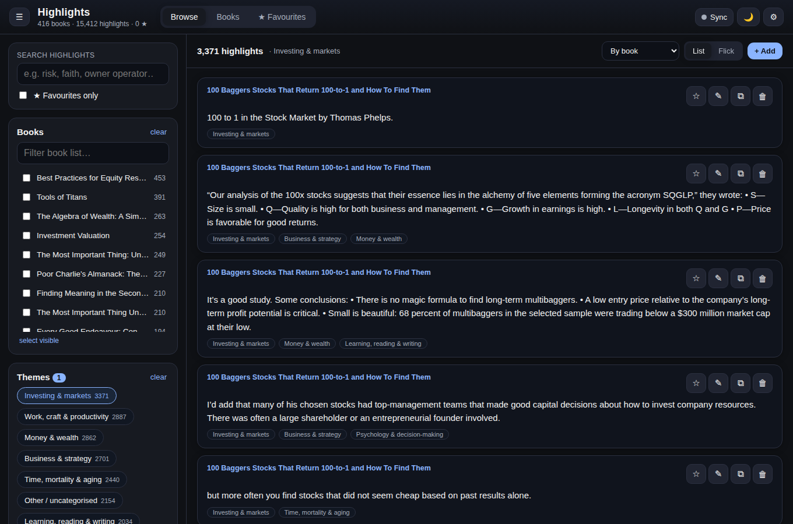
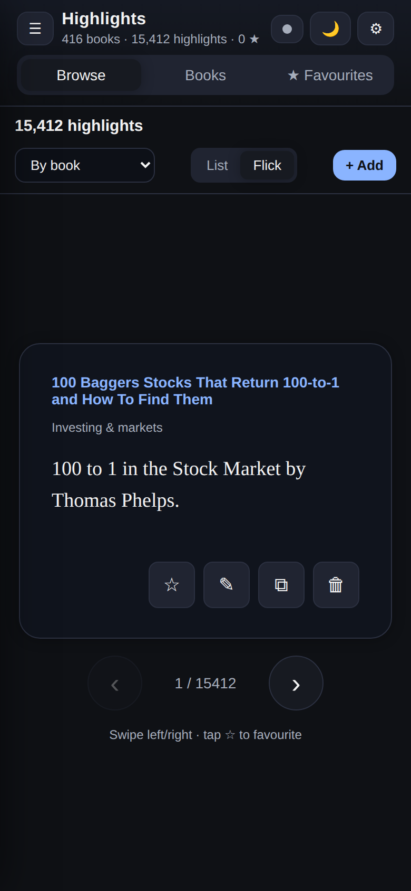

# Kindle Highlights

A fast, installable web app for exploring your Kindle highlights — select books,
themes and topics, search keywords, flick through highlights one at a time, save
favourites, and delete the ones you don't want. Runs on iPhone and desktop, works
offline, and syncs your favourites / notes / deletions / additions across every
device through a Google Sheet.

Built from a dataset of **416 books · 15,412 highlights · 22 themes**.

<p>
  
  
</p>

## Features

- **Browse & filter** — pick one or many books, one or many themes, and/or type a
  keyword search. Counts update live as you narrow down.
- **Two viewing modes** — a scrollable **List**, or **Flick** (one highlight at a
  time): swipe on mobile, arrow keys on desktop (`←` `→`, `F` to favourite, `Del` to delete).
- **Books explorer** — flick through books as cards with blurbs and top themes;
  tap one to jump to just its highlights.
- **★ Favourites** — save any highlight to a favourites folder, browsable on its own tab.
- **🗑 Delete** — hide highlights you don't want; the deletion syncs to every device
  (it's a reversible tombstone in the Sheet, never destroyed).
- **✎ Notes** and **⧉ Copy** on any highlight.
- **Add highlights** in-app, or in bulk by pasting into the Sheet (see below).
- **Offline PWA** — installs to your iOS home screen and desktop; loads instantly and
  works with no connection.
- Dark / light theme.

## How it's put together

- **Static PWA** hosted on **GitHub Pages** — no server to run or pay for.
- The **highlights are bundled** into the app (`data/*.json`) so it's instant and offline.
- A **Google Sheet is the sync database** for the things that change: favourites, notes,
  deletions, and any highlights you add. The app talks to it through a small **Google
  Apps Script web app** (no Google Cloud project or OAuth screen required).
- Until you connect a Sheet, everything still works and saves in the browser
  (localStorage). Connect a Sheet to sync across devices.

```
index.html · app.css · js/{app,store,sync}.js   the app
data/{books,themes,highlights,meta}.json          bundled seed (generated)
apps-script/Code.gs                               paste into your Sheet
scripts/extract_seed.py                           rebuild data/ from a dashboard export
scripts/import_clippings.py                       My Clippings.txt -> paste-ready rows
sw.js · manifest.webmanifest · icons/             PWA plumbing
```

## Run it locally

Any static server works:

```bash
python3 -m http.server 8000
# open http://localhost:8000
```

## Connect Google Sheets (one time, ~2 minutes)

1. Make a Google Sheet (go to <https://sheets.new>).
2. **Extensions → Apps Script**. Delete the placeholder code and paste in the contents
   of [`apps-script/Code.gs`](apps-script/Code.gs).
3. Near the top, change `TOKEN` to any secret string of your own.
4. In the toolbar, pick the **`setup`** function and click **Run**. Approve the
   permission prompt. This creates the tabs (`Favourites`, `Deleted`, `Notes`,
   `Highlights`, `Books`) with headers.
5. **Deploy → New deployment → Web app.** Set **Execute as: Me** and
   **Who has access: Anyone**. Click **Deploy** and copy the **Web app URL**
   (it ends in `/exec`).
6. Open the app → **⚙ Settings** → paste the URL and the same `TOKEN` →
   **Test & sync now**. The sync dot turns green.

Do this on your phone and laptop with the *same* URL + token and they stay in sync.

> Changing the script later? Edit it, then **Deploy → Manage deployments → (edit) →
> Version: New version → Deploy**. The URL stays the same.

## Adding more books & highlights

**A few at a time — in the app:** tap **+ Add**, choose an existing book or type a new
title, paste the text, tag themes, Save. It syncs to the Sheet.

**In bulk — paste into the Sheet:** open the **`Highlights`** tab and add rows:

| id | book_title | author | location | text | themes | addedAt |
|----|-----------|--------|----------|------|--------|---------|

Only `book_title` and `text` really matter — if the book is new it's created
automatically; `themes` is a comma-separated list of theme ids (optional). Then hit
**Sync** in the app.

**From a Kindle export:** convert your `My Clippings.txt` to paste-ready rows:

```bash
python3 scripts/import_clippings.py "My Clippings.txt" > rows.tsv
```

Open the `Highlights` tab, click the first empty row under the headers, and paste.
Sync in the app.

## Deploy to GitHub Pages

This repo includes a workflow that publishes on every push to `main`.

1. Push to GitHub (repo: `kindle-highlights`).
2. **Settings → Pages → Build and deployment → Source: GitHub Actions.**
3. The app goes live at `https://<your-username>.github.io/kindle-highlights/`.
4. On iPhone: open that URL in Safari → Share → **Add to Home Screen**.

## Rebuilding the bundled data

If you get a fresh dashboard export, regenerate `data/`:

```bash
python3 scripts/extract_seed.py path/to/kindle_highlights_dashboard.html
```

## Tests

A headless browser smoke test covers the core flows:

```bash
node scripts/smoke.mjs
```
